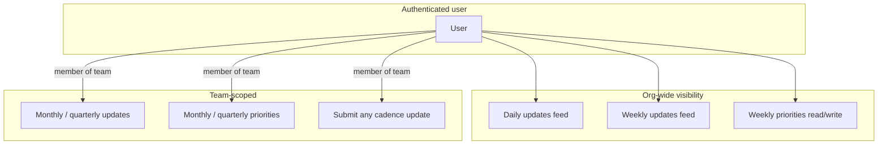

# Teaming — Feature inventory & cleanup guide

**Purpose:** Single source of truth for what the app does today (prototype-complete), what “done for everyone” should mean, and a prioritized backlog to get there.

**Related docs:** [Cadence spec](./cadence-spec.md) · [Hosting](./hosting.md) · [README](../README.md)

**Last reviewed:** 2025-06-01 (align with your ship date when you edit)

---

## 1. Product summary

Teaming (TE∆M) is a **progressive web app** for Mission-aligned team rhythm:

| Cadence   | Rhythm              | Primary output                          |
|-----------|---------------------|-----------------------------------------|
| Daily     | Standup             | Personal update + self Mission rating   |
| Weekly    | Learning            | Team update + **org-wide weekly priorities** |
| Monthly   | Systems             | Team update + team monthly priorities   |
| Quarterly | Strategic reset     | Team update + team quarterly priorities |

**North star:** Every action should increase the probability that people **rave and refer**.

**Deployment:** Vite + React + Supabase, GitHub Pages PWA.

---

## 2. Who uses it

| Persona              | Goal |
|----------------------|------|
| **New member**       | Sign up, set display name, join or create a team, submit first daily |
| **Daily contributor**| Post standup, read org activity, align to this week’s priorities |
| **Weekly facilitator** | Run weekly learning, maintain the **shared** weekly priority list |
| **Monthly / quarterly lead** | Set team-scoped priorities; team sees parent targets on forms |
| **Observer (no team yet)** | Read daily/weekly org feed; cannot submit until onboarded |

---

## 3. Status legend

Use this when grooming cleanup work:

| Status | Meaning |
|--------|---------|
| **Shipped** | Works end-to-end for intended users |
| **Prototype** | Implemented but rough UX, permissions, or edge cases |
| **Partial** | Backend or UI exists; not fully wired or consistent |
| **Planned** | Agreed product behavior; not built |

---

## 4. Feature inventory

### 4.1 Authentication & account

| Feature | Status | Notes |
|---------|--------|-------|
| Email + password sign-in | **Shipped** | `AuthPage`, Supabase email auth migration |
| Sign-up + optional display name | **Shipped** | Email confirmation message if Supabase requires it |
| Sign out | **Shipped** | Header on home |
| Missing Supabase env | **Shipped** | Clear error on auth page |
| Password reset / magic link | **Planned** | Not in app today |
| Profile edit after onboarding | **Partial** | Name only in onboarding card; no settings page |

### 4.2 Teams & onboarding

| Feature | Status | Notes |
|---------|--------|-------|
| Create team (name → slug) | **Shipped** | Creator becomes `lead`, set as `default_team_id` |
| Join team by slug | **Shipped** | Upsert as `member` |
| Display name required for setup | **Shipped** | `Onboarding` component |
| Multi-team membership | **Partial** | Data model supports it; UI only shows `default_team_id` |
| Switch team / leave team | **Planned** | No UI |
| Team admin (roles beyond lead/member) | **Planned** | `role` column exists; unused in UI |

**Without a team:** User can still view **daily & weekly org-wide activity**; cannot submit updates or Step 2 (monthly/quarterly).

### 4.3 Cadence updates (Step 1)

| Feature | Status | Notes |
|---------|--------|-------|
| Four cadence tabs + URL `?cadence=` | **Shipped** | `CadenceTabs`, `HomePage` |
| Question sets per cadence | **Shipped** | `cadenceConfig.ts` |
| Character bands (550 ideal) | **Shipped** | `CharTextarea`, `useCharBand` |
| Parent targets card (weekly+) | **Shipped** | Loads from parent priority cadence |
| Self Mission rating (daily only) | **Shipped** | 1–5 on submit |
| Submit to Supabase | **Shipped** | Requires team membership (RLS) |
| Copy preview to clipboard | **Shipped** | Emoji button |
| Live text preview | **Shipped** | Below form |
| Edit/delete own past updates | **Planned** | Insert-only today |
| One update per user per period | **Planned** | Multiple submits allowed per day/week |

### 4.4 Activity feed & team report

| Feature | Status | Notes |
|---------|--------|-------|
| **Org-wide feed** (daily + weekly) | **Shipped** | All authenticated users see all teams’ updates |
| **Team-scoped feed** (monthly + quarterly) | **Shipped** | Filtered to user’s team |
| Current vs archive periods | **Shipped** | `FeedViewTabs`, `PeriodNavigator` |
| Realtime refresh | **Shipped** | Supabase channels on updates / comments / ratings |
| Show team name as “Team: …” on cards | **Shipped** | Label only; not access control |
| Peer **Mission star ratings** | **Partial** | DB + `rateUpdate()` exist; UI shows **read-only** averages on daily only |
| Comment thread | **Partial** | **Daily only** in UI; RLS allows comments on daily **and** weekly |
| Weekly feed comments/ratings in UI | **Planned** | Policy allows insert; `TeamReport` hides thread for non-daily |

### 4.5 Priorities (Step 2)

| Feature | Status | Notes |
|---------|--------|-------|
| Weekly Step 2 form | **Shipped** | Goal / owner / metric / action rows |
| **Org-wide weekly list** (read on Daily tab) | **Shipped** | `AllWeeklyPriorities` |
| **Org-wide weekly save** | **Shipped** | `saveOrgWeeklyPriorities`, any authenticated user (migration) |
| Canonical storage team | **Prototype** | `VITE_ORG_TEAM_SLUG` (default `teaming`) or heuristic in `org.ts` |
| Merge fallback if no canonical team | **Prototype** | Merges all teams’ weekly rows for display |
| Monthly / quarterly Step 2 | **Shipped** | Per **team**; members only (RLS) |
| Cascade: weekly → daily targets | **Shipped** | Board on daily; daily form doesn’t show targets card (by design) |
| Cascade: monthly → weekly, quarterly → monthly | **Shipped** | `TargetsCard` on weekly/monthly forms |
| Priority history / diff | **Planned** | Archive tab is for **updates**, not priority sets |

### 4.6 PWA & platform

| Feature | Status | Notes |
|---------|--------|-------|
| Installable PWA | **Shipped** | `vite-plugin-pwa` |
| GitHub Pages SPA routing | **Shipped** | `404.html` copy on build |
| Offline support | **Planned** | No offline queue for submits |

---

## 5. Access & data model (important for cleanup)

| Data | Who can read | Who can write |
|------|----------------|---------------|
| Updates (daily, weekly) | All signed-in users | Team members only |
| Updates (monthly, quarterly) | Team members | Team members |
| Ratings / comments (daily, weekly) | All signed-in | All signed-in (shared feed policies) |
| Ratings / comments (monthly, quarterly) | Team members | Team members |
| Weekly `priority_sets` / items | All signed-in | All signed-in |
| Monthly / quarterly priorities | Team members | Team members |

**Migrations to apply in order** (after initial schema):

1. `20250530200000_email_auth.sql`
2. `20250530300000_feed_read_access.sql`
3. `20250530400000_shared_feed_interactions.sql`
4. `20250530500000_weekly_priorities_read_all.sql`
5. `20250530600000_weekly_priorities_write_all.sql`

---

## 6. User journeys (happy path)

### New user (first 10 minutes)

1. Open app → redirect to `/login` if not signed in.
2. Sign up → confirm email if required by Supabase project settings.
3. On home: complete **Welcome** card — display name, create or join team.
4. **Daily** tab: read **This week’s priorities** → fill standup → submit.
5. Scroll to **TE∆M ACTIVITY** — see others’ dailies; reply on a thread (daily only today).

### Weekly rhythm (facilitator)

1. **Weekly** tab: team submits learning updates (org-wide feed).
2. After discussion: **Step 2 — Our Weekly Priorities** → save (updates org list).
3. Everyone sees the list on **Daily** when planning “today.”

### Monthly / quarterly (team lead)

1. Ensure team has quarterly/monthly priorities from prior Step 2.
2. Form shows **parent targets** at top.
3. Submit update; feed is **team-only** (not org-wide).

---

## 7. Configuration

| Variable | Required | Purpose |
|----------|----------|---------|
| `VITE_SUPABASE_URL` | Yes | Supabase project |
| `VITE_SUPABASE_PUBLISHABLE_KEY` | Yes | Client anon/publishable key |
| `VITE_ORG_TEAM_SLUG` | No | Slug of team row holding org weekly priorities (default: `teaming`) |

**Ops checklist for new environments:**

- [ ] Run all migrations on Supabase
- [ ] Enable Realtime on `updates`, `update_comments`, `update_ratings`
- [ ] Create team with slug `teaming` (or set `VITE_ORG_TEAM_SLUG`) before relying on a single weekly list
- [ ] Decide: email confirmation on or off for sign-up copy in UI

---

## 8. Cleanup backlog (prioritized for “all users easily”)

Work in this order unless you have a blocking launch constraint.

### P0 — Confusion blockers

| # | Item | Why |
|---|------|-----|
| 1 | **First-run guide** (1 screen or checklist) | Onboarding card is easy to miss once feed is visible |
| 2 | **Document / enforce org weekly team** | Create `teaming` team in prod; remove merge fallback or log when multiple sets exist |
| 3 | **Clarify “Team:” label on cards** | Users think team controls visibility; daily/weekly are org-wide |
| 4 | **Apply migrations 305 + 306 in prod** | Weekly board breaks for non-members without read/write-all policies |

### P1 — Prototype gaps vs spec

| # | Item | Why |
|---|------|-----|
| 5 | **Wire peer Mission ratings** | `rateUpdate` unused; stars are read-only |
| 6 | **Weekly feed: comments (and ratings?)** | RLS allows; UI only on daily — align with [cadence-spec](./cadence-spec.md) |
| 7 | **Empty states** | “No activity” vs “join a team to submit” — tighten copy per cadence |
| 8 | **Error surfacing** | Many `console.error` only; user sees silent empty feeds |

### P2 — Scale & hygiene

| # | Item | Why |
|---|------|-----|
| 9 | **Limit duplicate updates** | One standup per user per day (optional soft warning) |
| 10 | **Profile / team settings page** | Change name, switch team, copy team slug for invites |
| 11 | **Password reset** | Standard expectation for email auth |
| 12 | **Archive: weekly priorities** | Match archive UX for updates |
| 13 | **Tighten weekly write policy** | Today any user can edit org list — consider facilitator role |

### P3 — Polish

| # | Item |
|---|------|
| 14 | Mobile tap targets, keyboard submit on comments |
| 15 | Loading skeletons instead of “Loading…” text |
| 16 | Accessibility pass (star buttons, tab order, labels) |
| 17 | Admin export / reporting (out of scope for PWA today) |

---

## 9. Definition of done (v1 “everyone can use it”)

Consider v1 production-ready when:

- [ ] Every CRL user can sign up, join a team, and submit daily without asking for help
- [ ] Org weekly priorities have **one** canonical list everyone sees on Daily
- [ ] Daily/weekly visibility rules are explained in-app (org-wide vs team-only)
- [ ] Peer feedback works as designed (rating and/or comments — pick one spec and ship it)
- [ ] Prod Supabase has all migrations applied and `teaming` (or configured slug) team exists
- [ ] No silent failures on feed load (user-visible error + retry)

---

## 10. Code map (quick reference)

| Area | Location |
|------|----------|
| Routes & auth gate | `src/App.tsx`, `src/context/AuthContext.tsx` |
| Main shell | `src/pages/HomePage.tsx` |
| Cadence copy & flags | `src/lib/cadenceConfig.ts` |
| Period math | `src/lib/periods.ts` |
| API / Supabase | `src/lib/api.ts`, `src/lib/org.ts` |
| Org weekly board | `src/components/AllWeeklyPriorities.tsx` |
| Step 2 | `src/components/PriorityStep2.tsx` |
| Feed shell | `src/components/ActivityFeed.tsx` |
| Report cards | `src/components/TeamReport.tsx` |
| Schema & RLS | `supabase/migrations/*.sql` |

---

## 11. Open product decisions

Record answers here before large refactors:

1. **Teams:** Labels only for daily/weekly, or should feeds ever be team-filtered?
2. **Weekly priorities:** Truly one global list, or one per team with a “publish to org” action?
3. **Peer ratings:** Required on every daily, or optional? Show on weekly learnings?
4. **Who can edit org weekly priorities?** All users (today) vs leads only?
5. **Update editing:** Allow edits within the same period or immutable audit trail?

---

*Update this doc when you ship a backlog item or change access rules.*
